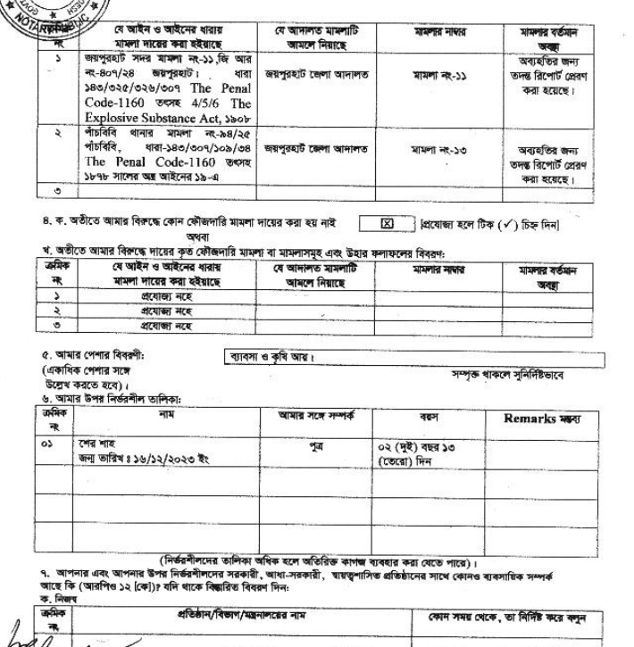
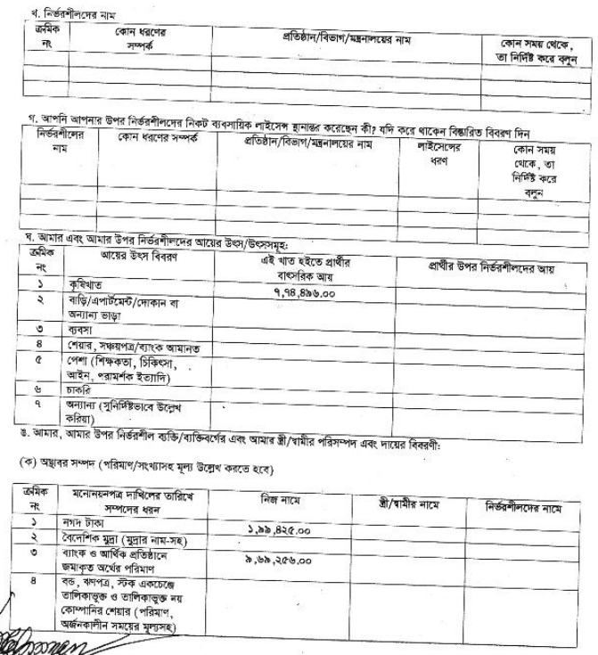
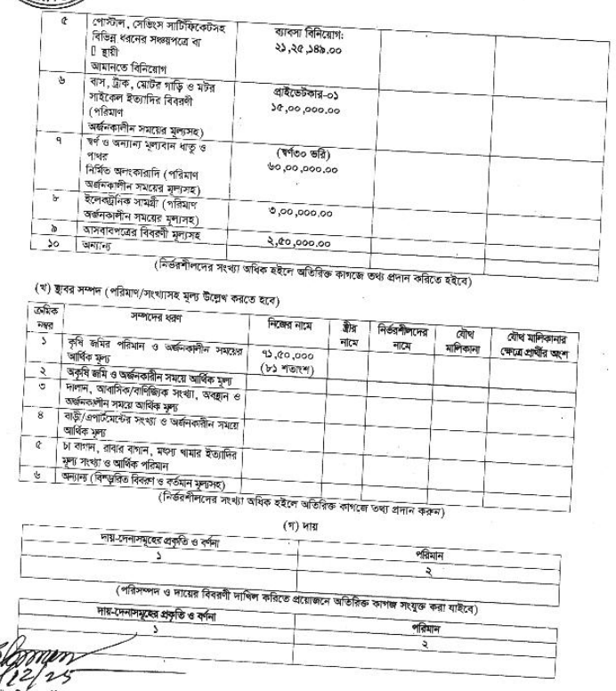
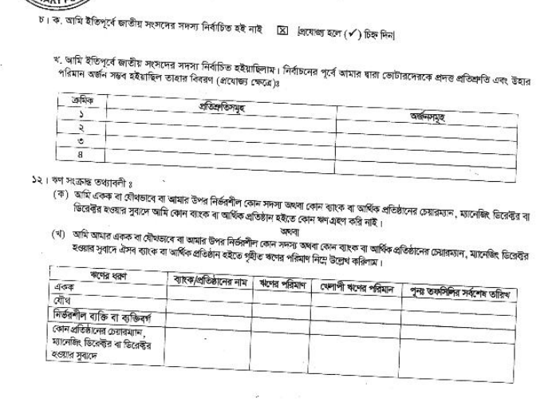
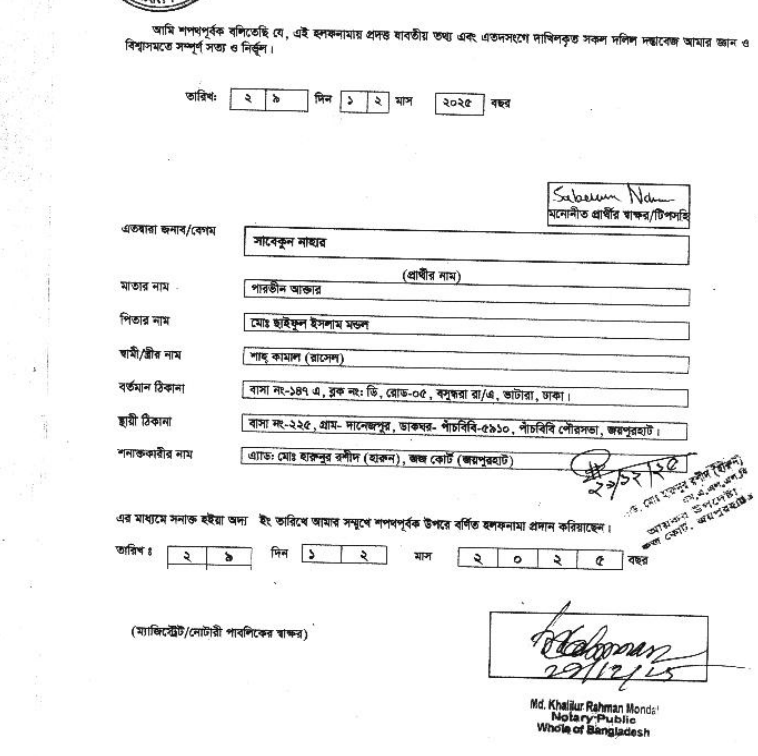

# Affidavit Form Changes - 2025 Update

This document describes all changes made to the Affidavit Form (হলফনামা) based on the new 2025 format.

**Updated Date:** January 2025
**Reference Images:** `halaf-01.png` to `halaf-06.png`

---

## Summary of Changes

### Files Modified
1. `client/app/modules/candidates/views/affidavit/edit.html`
2. `client/app/modules/candidates/controllers/affidavit/affidavit.ctrl.js`

### Total Changes
- **New Fields Added:** 17
- **Modified Fields:** 5
- **New Sections Added:** 1
- **New Controller Functions:** 2

---

## Section-wise Changes

### পাতা ১ (Page 1) - Personal Information

#### New Fields Added

| # | Field (Bengali) | Field (English) | Model Name | Type | Source |
|---|-----------------|-----------------|------------|------|--------|
| 1 | প্রচার নাম | Campaign Name | `campaignNameBnAF` | text | halaf-01 |
| 2 | স্থায়ী ঠিকানা | Permanent Address | `permanentAddressBnAF` | textarea | halaf-01 |
| 3 | জাতীয় পরিচয়পত্র আছে কি | Has National ID | `hasNationalIdAF` | radio (yes/no) | halaf-01 |
| 4 | জাতীয় পরিচয়পত্র নং | National ID Number | `nationalIdNumberAF` | text | halaf-01 |
| 5 | ভোটার নম্বর | Voter Number | `voterNumberAF` | text | halaf-01 |
| 6 | অতীতে নাগরিকত্ব ত্যাগ | Abandoned Citizenship | `abandonedCitizenshipAF` | radio (yes/no) | halaf-01 |
| 7 | আগের দেশ | Previous Country | `previousCountryAF` | text | halaf-01 |
| 8 | নির্বাচনী এলাকার নাম ও নং | Electoral Area Name | `electoralAreaNameAF` | text | halaf-01 |
| 9 | আয়কর ফাইল জমার তারিখ ১ | Income Tax File 1 | `incomeTaxFile1AF` | text | halaf-01 |
| 10 | আয়কর ফাইল জমার তারিখ ২ | Income Tax File 2 | `incomeTaxFile2AF` | text | halaf-01 |
| 11 | আয়কর ফাইল জমার তারিখ ৩ | Income Tax File 3 | `incomeTaxFile3AF` | text | halaf-01 |
| 12 | সার্টিফিকেট জমা অঙ্গীকার | Certificate Pledge | `willSubmitCertificatesAF` | checkbox | halaf-01 |
| 13 | সৌজন্যে সদস্য | Courtesy Member | `isCurrentCourtesyMemberAF` | radio (yes/no) | halaf-01 |
| 14 | সৌজন্যে সদস্য বিবরণ | Courtesy Member Details | `courtesyMemberDetailsAF` | text | halaf-01 |

#### Modified Fields

| Old Field | New Field | Model Change |
|-----------|-----------|--------------|
| পিতা/স্বামীর নাম | পিতার নাম | `fatherHusbandNameBnAF` → `fatherNameBnAF` |
| মাতার নাম | মা/স্বামীর নাম | `motherNameBnAF` → `motherHusbandNameBnAF` |
| ঠিকানা | বর্তমান ঠিকানা | `addressBnAF` → `presentAddressBnAF` |

---

### পাতা ১ (Page 1) - Criminal Cases Section

#### New Column Added to Both Tables

| Column (Bengali) | Column (English) | Model Field | Source |
|------------------|------------------|-------------|--------|
| আদালত নির্দেশনা | Court Direction | `courtDirection` | halaf-02 |

#### Updated Table Structure

**Before (5 columns):**
```
ক্রমিক নং | যে আইন ও ধারায় | যে আদালত | মামলা নম্বর | বর্তমান অবস্থা
```

**After (6 columns):**
```
ক্রমিক নং | যে আইন ও ধারায় | মামলা নম্বর | যে আদালত | আদালত নির্দেশনা | বর্তমান অবস্থা/ফলাফল
```

---

### পাতা ১ (Page 1) - New Section: Dependents

#### New Section Added (Item ৫)

**Section Title:** আমার উপর নির্ভরশীল ব্যক্তিবর্গ (Dependents)

**Table Structure (`dependentsAF[]`):**

| Column | Bengali | English | Type |
|--------|---------|---------|------|
| 1 | ক্রম | Serial | auto |
| 2 | নাম | Name | text |
| 3 | সম্পর্ক | Relationship | select |
| 4 | জন্ম তারিখ | Date of Birth | text |
| 5 | বয়স | Age | number |
| 6 | মন্তব্য | Remarks | text |

**Relationship Options:**
- স্বামী/স্ত্রী (spouse)
- পুত্র (son)
- কন্যা (daughter)
- পিতা (father)
- মাতা (mother)
- ভাই (brother)
- বোন (sister)
- অন্যান্য (other)

---

### Signature Section Changes

#### New Fields Added

| # | Field (Bengali) | Field (English) | Model Name | Source |
|---|-----------------|-----------------|------------|--------|
| 1 | স্বামী/স্ত্রীর নাম | Spouse Name | `spouseNameAF` | halaf-06 |

#### Modified Layout

**Before:**
```
প্রার্থীর নাম → পিতা/স্বামীর নাম → মাতার নাম → ঠিকানা
```

**After:**
```
প্রার্থীর নাম → মাতার নাম → পিতার নাম → স্বামী/স্ত্রীর নাম → বর্তমান ঠিকানা → স্থায়ী ঠিকানা
```

---

## Controller Changes

### New Functions Added

```javascript
// Add dependent
this.add_dependentsAF = function () {
  if (!$scope.gotCandidate.hasOwnProperty("dependentsAF"))
    $scope.gotCandidate.dependentsAF = [];
  $scope.gotCandidate.dependentsAF.push({});
};

// Delete last dependent
this.delete_dependentsAF = function () {
  $scope.gotCandidate.dependentsAF.pop();
};
```

---

## HTML Code Changes Summary

### Lines Added/Modified

| Section | Lines Changed | Type |
|---------|---------------|------|
| Personal Info | +50 lines | New fields |
| Criminal Cases (Present) | +2 columns | Modified |
| Criminal Cases (Past) | +2 columns | Modified |
| Dependents Section | +45 lines | New section |
| Signature Section | +15 lines | Modified |

### Total Impact
- **HTML File:** +173 lines, -37 lines modified
- **JS Controller:** +9 lines added

---

## Data Model Changes

### New Model Fields Required

Add these fields to the Candidate model (`common/models/candidate.json`):

```json
{
  "campaignNameBnAF": { "type": "string" },
  "fatherNameBnAF": { "type": "string" },
  "motherHusbandNameBnAF": { "type": "string" },
  "presentAddressBnAF": { "type": "string" },
  "permanentAddressBnAF": { "type": "string" },
  "hasNationalIdAF": { "type": "boolean" },
  "nationalIdNumberAF": { "type": "string" },
  "voterNumberAF": { "type": "string" },
  "abandonedCitizenshipAF": { "type": "boolean" },
  "previousCountryAF": { "type": "string" },
  "electoralAreaNameAF": { "type": "string" },
  "incomeTaxFile1AF": { "type": "string" },
  "incomeTaxFile2AF": { "type": "string" },
  "incomeTaxFile3AF": { "type": "string" },
  "willSubmitCertificatesAF": { "type": "boolean" },
  "isCurrentCourtesyMemberAF": { "type": "boolean" },
  "courtesyMemberDetailsAF": { "type": "string" },
  "dependentsAF": { "type": "array" },
  "spouseNameAF": { "type": "string" }
}
```

---

## Migration Notes

### For Existing Data

1. **Address Migration:**
   - Copy `addressBnAF` to both `presentAddressBnAF` and `permanentAddressBnAF`

2. **Name Field Migration:**
   - `fatherHusbandNameBnAF` → `fatherNameBnAF` (for father's name)
   - Create new `motherHusbandNameBnAF` for mother/husband

3. **Criminal Cases:**
   - Existing data will work, `courtDirection` field will be empty for old records

### Backward Compatibility

- Old form data will display correctly
- New fields will be empty for existing records
- No data loss expected

---

## Reference Images

All reference images are stored in `docs/images/` folder.

### halaf-01.png
Header, personal info, NID, voter, citizenship, tax info


---

### halaf-02.png
Criminal cases with court direction, dependents section



---

### halaf-03.png
Income sources, movable assets



---

### halaf-04.png
Movable assets (continued), immovable assets, liabilities



---

### halaf-05.png
Previous MP status, loans section



---

### halaf-06.png
Signature section with spouse name, notary details


